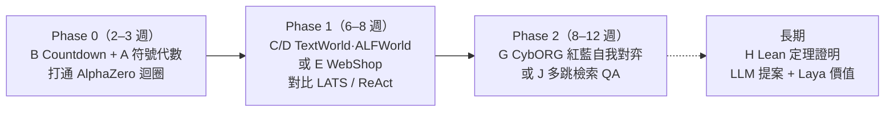
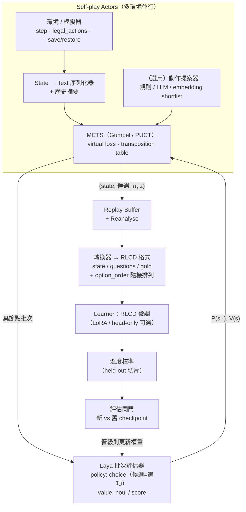

# Laya × MCTS：AlphaGo / AlphaZero 式專案的候選問題評估

> 撰寫日期：2026-10-03　｜　Laya 參考版本：`laya` 0.3.24（GitHub `NandhaKishorM/laya`，Apache 2.0）
>
> 本文的 Laya 規格與數字，除特別註明外，都取自其官方 README / `docs/` 與原始碼（`laya/common.py`、`laya/agent.py`）。這些數據屬作者自行量測，正式立項前應在自己的硬體與資料上重測。

---

## 0. 摘要（TL;DR）

1. **Laya 不是生成式模型，而是「文字狀態 → 帶校準機率的型別化決策」的編碼器模型。** 它在 AlphaZero 架構中的角色可以直接對應：
   - **Policy network** → `choice` 問題（候選動作即選項，輸出每個動作的機率 = PUCT 的先驗 P(s,a)）
   - **Value network** → `noul`（P(成功/獲勝)）或 `score`（分級的價值分佈）
   - **訓練目標** → Laya 的 RLCD 微調本來就是「對**軟目標分佈**做 soft cross-entropy + 嚴格適當評分規則（proper scoring rule）」，與 AlphaZero 的損失函數（對 MCTS 拜訪分佈 π 做交叉熵 + 對結果 z 做價值迴歸）在形式上幾乎相同，資料格式轉換的成本很低。
2. **主要限制：** Laya 無法生成動作，所以候選動作必須由模擬器列舉，或由外部生成器（規則 / LLM）提出。單一問題預設約 20 個選項就到了 token 預算上限；context 只有 512–1024 token；單次推論 7–40 ms，比 AlphaZero 常用的小型 ResNet 慢 2–3 個數量級。base checkpoint 對新任務的 zero-shot 表現接近隨機，**一定要經過微調**。
3. **適合的問題特徵：** 狀態本來就是自然語言或結構化文字、每步可列舉的候選動作少於 20 個（或能先篩成這樣）、有可程式化驗證的終局獎勵、模擬器便宜而且**可以存檔 / 還原**（MCTS 必須能回溯）、決策深度屬中短程（約 5–50 步）。
4. **推薦組合：**

| 角色 | 推薦問題 | 理由 |
|---|---|---|
| Phase 0：打通整條管線 | **A. 符號代數化簡**（或 B. Countdown / 24 點） | 模擬器幾天就能自己寫完，不需要外部資料，可以快速驗證「MCTS → 軟目標 → RLCD 微調 → 更強的 MCTS」這個迴圈 |
| Phase 1：主線研究 | **C. TextWorld / Jericho** 或 **D. ALFWorld**；**E. WebShop** | 現成的文字模擬器，可列舉合法動作，支援存檔 / 還原，也有 MCTS + LM 的前例可以比較（文字遊戲：MC-LAVE、MC-DML；ALFWorld：SEEA-R1；WebShop：LATS、Agent Q） |
| Phase 2：最像 AlphaZero 的方向 | **G. 資安攻防（CybORG / CyberBattleSim）紅藍隊自我對弈** | 真正的雙人對抗加上自我對弈，也剛好對上 Laya 已經微調過的「security incidents」工作流程領域 |
| 長期 / 高風險高報酬 | H. Lean 定理證明（Laya 只當價值網路 / 重排序器） | 獎勵可以完美驗證（AlphaProof 路線），但需要 LLM 生成 tactic，工程量很大 |

---

## 1. Laya 能力盤點：怎麼對應到 AlphaZero

### 1.1 Laya 是什麼

- 由 Convai Innovations 開發，2026-09 開源（Apache 2.0），定位是「System 1 decision model」，與 TypeSafe 的 Jev 相容（`POST /v1/systemone` 協定）。
- **非自迴歸**：輸入一個 state（`str` / `dict` / `list`，例如文字、email、JSON）和一組型別化問題，**一次 forward pass** 就回傳所有答案與機率，不產生任何文字。
- 架構：雙向 Transformer encoder（ModernBERT / mmBERT），加上 2 層 Transformer decision head。每個選項前放一個 `[MASK]` 標記，標記位置的 hidden state 經過 `scorer` MLP 得到該選項的 logit，再做 softmax（見 `laya/common.py: DecisionModel`）。
- 序列格式：`[CLS] <type> instructions [SEP] [MASK] opt0 [MASK] opt1 ... [SEP] state [SEP]`。**選項是文字**，所以每個 state 的動作集合可以不同。這點對 MCTS 很有利，因為不需要固定大小的 action head。

| checkpoint | encoder | 參數 | context | 備註 |
|---|---|---|---|---|
| `laya` | ModernBERT-large | 421M | 512 | 英文最強 |
| `laya-multilingual` | mmBERT-base | 322M | 1024（可拉到 8192） | 100+ 語言，速度約快 2 倍，**支援中文** |
| `laya-typed-decisions` | ModernBERT-large | 421M | 1024 | 在 4 類企業工作流程上微調過（客服、發票、資安事件、agent trace） |

### 1.2 三種問題型別在 AlphaZero 中的角色

| Laya 型別 | 輸出 | AlphaZero 中的用途 |
|---|---|---|
| `choice` | 各選項機率分佈 | **Policy prior** P(s,·)：選項 = 候選動作 |
| `noul` | P(true) ∈ [0,1] | **Value**：「從此狀態出發最終會成功 / 獲勝嗎？」→ V(s) = 2·P − 1 |
| `score` | 有序等級上的分佈與期望值 | **分佈式價值**（類似 MuZero 的 categorical value），或「剩餘步數」估計（例如 1–3 步、4–10 步、>10 步、無解） |

同一個 state 的 policy 問題與 value 問題可以放進**同一次 `predict` 呼叫**，共用一次 forward pass（實際上是 2 個 row）。

### 1.3 訓練方法與 AlphaZero 損失的對應

Laya 的 RLCD 微調（`notebooks/laya_finetune_typed_decisions_*.py`）：
- 每筆訓練資料的格式是 `state`、`questions`、`gold`（**每個問題的軟目標機率分佈**）
- 損失 = **soft cross-entropy（對 gold 分佈）** + GRPO 式 policy gradient（對 logits 加噪聲取樣，獎勵 = log score + spherical score + RPS，皆為嚴格適當評分規則）
- 微調後要做溫度校準（每種問題型別各擬合一個 temperature）
- 原始碼裡已經有 `td_lambda_targets()`，可以為多步軌跡計算 TD(λ) 目標

**對應關係：**

| AlphaZero | Laya 微調資料 |
|---|---|
| MCTS 根節點的拜訪次數分佈 π(a\|s) | policy `choice` 問題的 `gold` |
| 終局結果 z（或 n-step / TD(λ) bootstrapped value） | value `noul` 問題的 `gold = [1−z', z']` |
| L = (z−v)² − πᵀ log p + c‖θ‖² | soft CE + proper-scoring reward（log score 本身就是交叉熵） |
| 棋盤對稱性的資料擴增 | **選項順序隨機排列**（`option_order`）：既是擴增，也能消除 Laya 已知的位置偏差（README #131） |

**結論：Laya 現有的微調管線，加上一個「把 MCTS 搜尋樹匯出成 `gold` 分佈」的轉換器，就能構成 AlphaZero 的訓練步驟，不必改模型結構。**

### 1.4 必須正視的限制（篩選候選問題的依據）

| # | 限制 | 對問題選擇的影響 |
|---|---|---|
| L1 | **無法生成文字**，只能從選項中挑選或打分 | 動作要能由模擬器列舉，或由外部生成器提出 |
| L2 | **選項 token 預算**：`head_max_len` 預設 192/256，超過約 20 個選項後每個選項會被截斷（77 選項的 Banking77 只有 0.425） | 分支因子最好 ≤ 20；更多時要用 `predict_shortlist`（embedding 先篩）、階層式選擇，或調高 `head_max_len` |
| L3 | **context 512–1024 token** | state 要精簡，歷史軌跡需摘要；長文件狀態（例如長證明、大型 DB schema）不利 |
| L4 | **推論成本**：T4 上約 33–40 ms/題，批次約 7 ms/題；RTX 5060 Ti 批次約 1 ms/決策 | 每步模擬次數只能到數十～數百次，建議用 Gumbel MuZero 這類低模擬預算的演算法 |
| L5 | **zero-shot 接近隨機**（typed-decisions 上 0.36，隨機 0.318） | 需要冷啟動資料（規則 / LLM teacher / 純 rollout MCTS）先做監督式暖身，也就是 AlphaGo 的「SL → RL」路線，而不是從零開始的 AlphaZero |
| L6 | 已知弱點：數字推理弱（BERT 系通病）、否定句誤判（#377）、`score` 是最弱的型別、選項位置偏差 | 純數值狀態的問題（排程、路徑）不利；value 優先用 `noul` |
| L7 | `Agent.predict_batch` 要求**所有 state 共用同一組問題** | MCTS 葉節點的候選動作各不相同，必須自寫批次評估器，直接呼叫 `build_sequence` + `collate_items` + `DecisionModel.forward` |
| L8 | 發布才約兩週（2026-09-18），社群經驗少，benchmark 多為作者自測 | 要預留驗證時間；鎖定版本 / revision |

### 1.5 算力預算的粗估

每步需要 `N_sim` 次葉節點評估，每次 2 個 row（policy + value）：

```
rows / episode ≈ L(步數) × N_sim × 2
時間 / episode ≈ rows × t_row（批次化後）
```

| 情境 | L | N_sim | rows | T4（≈7 ms/row） | RTX 5060 Ti 級（≈1 ms/row） |
|---|---|---|---|---|---|
| 符號代數 / Countdown | 6 | 32 | 384 | ~2.7 s | ~0.4 s |
| TextWorld / ALFWorld | 30 | 32 | 1,920 | ~13 s | ~2 s |
| WebShop | 10 | 16 | 320 | ~2.2 s（加上環境延遲） | ~0.3 s |

一萬局自我對弈在單張 T4 上需要數小時到一兩天，**可行但很緊**。所以建議：Gumbel 根節點選擇（N_sim 小也能保證 policy improvement）、tree reuse、transposition table、ONNX / INT8 推論、多環境並行配合 virtual loss 做批次葉節點評估。

**每一輪迭代的微調成本：** 官方的全量 RLCD 在 2×T4 上跑 30k 題 × 4 epoch 約需 4–5 小時。AlphaZero 迴圈每輪不需要跑這麼多，建議每輪只訓練 1 epoch、使用 replay buffer，必要時凍結 encoder 只訓練 head（社群工具 `stuntd` 的作法），或用 LoRA。

---

## 2. 評估維度定義

| 維度 | 說明 | 等級 |
|---|---|---|
| **適合度** | 與 Laya 的特性（文字狀態、可列舉的少量候選、型別化決策）和 MCTS 的需求（模擬器、可回溯、可驗證獎勵、決策深度）的整體契合程度 | ★1–★5 |
| **資料集 / 模擬器工作量** | 取得資料、建立或包裝模擬器、狀態轉文字、動作列舉、存檔 / 還原、獎勵函數的總工程量 | 極低（< 1 週）／低（1–2 週）／中（3–6 週）／高（> 6 週），以 1 名熟練工程師估 |
| **finetune 難易度** | 領域偏移、候選數、context 長度、是否需要冷啟動 teacher、目標雜訊與迭代成本 | 易／中／難 |

---

## 3. 候選問題總覽

| # | 候選問題 | 適合度 | 資料集 / 模擬器工作量 | finetune 難易度 | 一句話評語 |
|---|---|---|---|---|---|
| A | 符號代數化簡 / 解方程（自建 SymPy 環境） | ★★★★☆ | **低** | 中 | 最佳管線驗證題，獎勵完美，動作可列舉 |
| B | Countdown / 24 點 | ★★★☆☆ | **極低** | 中 | 驗證最快，但很考驗 BERT 的數字推理 |
| C | 文字冒險遊戲（TextWorld / Jericho） | ★★★★☆ | 低 | 中 | 狀態本身就是文字，有合法動作清單，`get_state/set_state` 現成 |
| D | 文字具身任務（ALFWorld / ScienceWorld） | ★★★★☆ | 中 | 中 | 比 C 更貼近「代理人任務」，ScienceWorld 的動作數大，需要篩選 |
| E | 網購 / 網頁導覽（WebShop；MiniWoB++ / BrowserGym） | ★★★★☆ | 中（WebArena：高） | 中 | 已有 Laya 瀏覽器決策頭與 Agent Q 的前例 |
| F | 客服 / 業務流程代理（τ-bench retail/airline） | ★★★☆☆ | 中～高 | 易～中 | 與 Laya 預訓練領域最接近，但需要 LLM 使用者模擬器與參數生成 |
| G | 資安攻防模擬（CybORG CAGE / CyberBattleSim） | ★★★★☆ | 中 | 中 | **唯一真正雙人、可自我對弈**的文字化問題，也對上 Laya 的資安領域 |
| H | 形式化定理證明（Lean 4 + LeanDojo / miniF2F） | ★★★☆☆ | 高 | 難 | 獎勵完美，但 Laya 只能當價值網路 / 重排序器 |
| I | Text-to-SQL 逐步建構 / 修正（Spider / BIRD） | ★★☆☆☆ | 中 | 中～難 | 執行器即模擬器，但 schema 太長、動作需生成 |
| J | 多跳檢索問答代理（HotpotQA / MuSiQue + 檢索） | ★★★☆☆ | 中 | 中 | 動作 = 選文件 / 選查詢 / 作答，貼近 Laya 的 NLI / BoolQ 強項 |
| K | 策略性對話（談判 CraigslistBargain / Deal or No Deal） | ★★☆☆☆ | 高 | 中 | 要先抽象成對話行為，還需要對手模擬器 |
| L | 化學逆合成規劃（USPTO-50K + RDKit 模板） | ★★☆☆☆ | 中 | 難 | MCTS 非常適合（3N-MCTS 前例），但 SMILES 不適合 Laya 的 tokenizer |
| — | 組合最佳化（JSSP 排程、VRP 路徑） | ★☆☆☆☆ | 低～中 | 難 | 純數值問題，GNN 或 MLP 遠比 Laya 適合，**不建議** |
| — | 棋類 / 傳統遊戲（圍棋、西洋棋、Atari） | ★☆☆☆☆ | 低 | 難 | 原始需求已排除：網格狀態轉文字效率極差 |

---

## 4. 各候選問題詳述

每題依「問題定義 → Laya / MCTS 映射 → 資料集與模擬器 → finetune 評估 → 風險」說明。

### A. 符號代數化簡 / 解方程　★★★★☆

- **問題定義**：給定代數式或方程（例如 `2(x+3) - 4 = 3x + 1`），每步套用一條改寫規則（展開、合併同類項、移項、因式分解、約分……），以最少步數得到最簡式或解。
- **映射**
  - state：目前的式子（純文字或 LaTeX）加上最近 1–2 步
  - 動作：「規則 × 子式位置」中**可套用**的組合，通常 5–30 個。超過 20 個時，用規則類別做第一層 `choice`、位置做第二層，或用 shortlist
  - value：`noul`「此式能在 K 步內化簡完成嗎？」或 `score`「剩餘步數級距」
  - 獎勵：用 SymPy 驗證等價且達到標準形式時為 1，每步扣一點步數懲罰
- **資料集 / 模擬器：低（1–2 週）**
  - 模擬器：用 SymPy 寫狀態轉移（約 20–40 條規則）。狀態只是字串，存檔 / 還原沒有成本
  - 資料：用程式隨機生成題目（由解反向推出題目），難度可調，**完全不需要外部資料**。也可以參考 DeepMind Mathematics Dataset 或 Lample & Charton 的符號積分資料
- **finetune：中**
  - 有利：選項是短的規則描述；context 很短；可以先用 BFS / A* 得到最優步，做監督式冷啟動
  - 不利：數學符號與 ModernBERT 的預訓練語料差距大；數字與括號結構對 BERT tokenizer 不友善（例如 `x^2` 會被拆開）。建議先比較 `laya` 和 `laya-multilingual` 的 tokenization 效果
- **風險**：規則集設計會決定問題難度；太簡單時 MCTS 沒有發揮空間，要設計需要「先變複雜再化簡」的題型（例如先展開再因式分解），讓搜尋有價值。

### B. Countdown / 24 點　★★★☆☆

- **問題定義**：給 4–6 個數字和目標數，用四則運算組合出目標（Tree-of-Thoughts 的經典題）。
- **映射**：state = 剩餘數字 + 目標；動作 = 「選兩數 × 運算子」（4 個數時最多 36 個，可以先過濾掉負數和非整數結果）；value = `noul`「還湊得出來嗎？」；獎勵 = 是否得到目標。
- **資料集 / 模擬器：極低（2–3 天）**：幾十行 Python 就能寫完，窮舉法可以給出完美的價值標籤。
- **finetune：中**：資料無限且有完美 teacher；但數值推理是 BERT 系模型的弱項（L6），value 準確度可能會卡住。這反過來是一個很好的「Laya 數字能力上限」探針。
- **用途**：建議當 A 之前的冒煙測試（smoke test），一週內就能跑出第一條 Elo / 成功率曲線。

### C. 文字冒險遊戲（TextWorld / Jericho）　★★★★☆

> 原始需求排除了「遊戲」，指的是棋盤、像素這類需要把非文字狀態轉成文字的遊戲。文字冒險遊戲的觀測與動作**本來就是自然語言**，沒有這個問題，所以列入候選。若仍想避開「遊戲」，可以直接看 D。

- **映射**：state = 目前觀測 + 物品欄 + 歷史摘要；動作 = 環境提供的合法指令（TextWorld `admissible_commands`、Jericho `get_valid_actions()`），通常 10–50 個，可用 shortlist 篩到 20 個以內；value = `noul`「能完成任務嗎？」；獎勵 = 遊戲分數 / 任務完成。
- **資料集 / 模擬器：低（1–2 週）**
  - `pip install textworld` / `jericho`。TextWorld 能**程序化生成**任意難度的遊戲（資料無限）；Jericho 收錄數十款經典 Z-machine 遊戲
  - **Jericho 原生支援 `get_state()` / `set_state()`**，正好滿足 MCTS 回溯的需求；TextWorld 可以用重播動作序列達到同樣效果
- **finetune：中**：狀態是英文敘事，與 Laya 的預訓練分佈接近（優勢）。難點是長期依賴：歷史超過 512–1024 token 時需要摘要或結構化記憶；稀疏獎勵需要 TD(λ) 或中間獎勵塑形。
- **前例**：MC!Q*BERT、Go-Explore for text games；MCTS 方面有 MC-LAVE（MCTS + 語言動作價值估計，規劃與學習交替進行，在 Jericho 上測試）與 MC-DML（MCTS 以 LLM 當先驗，加上記憶機制，同樣在 Jericho 上測試），基準可以比較。

### D. 文字具身任務（ALFWorld / ScienceWorld）　★★★★☆

- **問題定義**：在文字化的家居（ALFWorld，例如「把冰過的蘋果放進微波爐」）或科學實驗（ScienceWorld，30 類任務）環境中完成多步任務。
- **映射**：同 C。ALFWorld 每步的合法動作通常 10–40 個；ScienceWorld 的「動作模板 × 物件」組合可達數百甚至上千，**必須先用 embedding shortlist 或階層式 choice**（先選動詞再選物件）。
- **資料集 / 模擬器：中（2–4 週）**：兩者都可以 pip 安裝，有 expert demonstration（ALFWorld 有 PDDL expert）可以當冷啟動資料。ALFWorld 建立在 TextWorld 上，存檔 / 還原同 C；ScienceWorld 要確認存檔 API，否則只能重播。
- **finetune：中**：ALFWorld 有現成的 expert 軌跡可做 SL 暖身，是很好的 AlphaGo 式「先模仿再自我改進」設定；ScienceWorld 難度高很多（動作空間大、步數長）。
- **前例**：ReAct、Reflexion 都用過 ALFWorld，方便和 LLM-based agent 比較「小型 System 1 + 搜尋 vs 大型 LLM」。（LATS 沒有測 ALFWorld，它的實驗是 HotPotQA、WebShop、程式與 Game of 24。）ALFWorld 上和本專案更接近的是：原論文的 BUTLER（小型模型，用 PDDL expert + DAgger 訓練，測試時用 beam search）、SEEA-R1（7B 模型以 MCTS 收集樹狀軌跡再做 Tree-GRPO 自我演化），以及 ETO（從探索得到的失敗軌跡做 DPO）。

### E. 網購 / 網頁導覽（WebShop；MiniWoB++、BrowserGym、WebArena）　★★★★☆

- **問題定義**：WebShop：根據使用者需求（例如「找一個 30 美元以下的防水藍牙喇叭」）在模擬電商網站上搜尋、點擊、選規格、購買，獎勵是屬性匹配分數（0–1）。
- **映射**：state = 指令 + 頁面摘要（標題、價格、規格）；動作 = 可點擊元素（`click[...]`），搜尋詞可以由指令產生數個候選，或交給外部 LLM 提出；value = `noul`「此路徑最終能買到符合的商品嗎？」或 `score`（獎勵級距）。
- **資料集 / 模擬器**
  - **WebShop：中（2–4 週）**：官方提供約 118 萬商品與約 1.2 萬條指令，需要架設 Flask + 搜尋引擎（pyserini / Java），部署稍麻煩。環境是確定性的，可以用重播動作序列回溯
  - MiniWoB++ / BrowserGym：低～中，任務短、可重置
  - WebArena：**高**，需要 docker 架設多個網站；真實網站的狀態難以快照，MCTS 回溯不易（要重置整個 DB 或重播），不建議當第一題
- **finetune：中**：已有直接前例，Laya 官方文件 `docs/finetune_browser_agent.md` 在單張 16 GB GPU 上把元素 top-1 從 0.10 提升到 0.66、真實任務成功率從 0% 提升到 62%，延遲 17–23 ms/步。關鍵經驗是**把候選元素放進選項，而不是 state**（`head_max_len` 調到 768）。Agent Q（MCTS + DPO）也在 WebShop 上證明了 MCTS 對網頁代理的效益。
- **風險**：搜尋動作需要文字生成（L1）；頁面資訊量大，容易超出 context（L3）。

### F. 客服 / 業務流程代理（τ-bench retail / airline）　★★★☆☆

- **問題定義**：代理人依照公司政策，透過工具（查訂單、退款、改航班……）與（模擬）顧客多輪互動，完成請求且不違反政策。
- **映射**：state = 對話摘要 + 已查到的資料 + 政策要點；動作 = 「下一個工具 / 回覆類型」的 `choice`（約 10–15 種）；value = `noul`「會成功且不違規嗎？」。
- **資料集 / 模擬器：中～高（4–8 週）**
  - τ-bench 開源，但**使用者模擬器是 LLM**：每一步都要 API 呼叫，有成本、有隨機性、也難以存檔回溯（要固定 seed 並重播對話）
  - 工具參數（訂單編號、金額）需要從對話中**抽取**，這是生成任務，需要規則或 LLM 輔助
- **finetune：易～中**：與 `laya-typed-decisions` 的客服工作流程、以及 Laya 的 triage presets 最接近，領域偏移最小；中文客服可以用 `laya-multilingual`。
- **風險**：模擬器成本會壓縮 MCTS 的模擬次數；隨機的使用者回應讓搜尋樹變成 chance node（需要 Stochastic MuZero 或 open-loop MCTS 的思路）。

### G. 資安攻防模擬（CybORG CAGE Challenge / CyberBattleSim）　★★★★☆

- **問題定義**：在模擬企業網路中，藍隊（防守：監控、隔離、還原主機）對抗紅隊（攻擊：掃描、提權、橫向移動）。
- **映射**
  - state：把網路與主機狀態**序列化成文字或 JSON**（「主機 User2：發現可疑程序；Op_Server0：未受損……」）
  - 動作：每個角色的離散動作 × 目標主機，數十～上百個，建議兩層 `choice`（先選動作類型，再選主機）
  - value：`noul`「本回合結束時防守成功嗎？」
  - **雙人零和**：紅藍兩方都用 Laya 加 MCTS，構成**真正的 AlphaZero 式自我對弈**；這是本清單中唯一天然具備對抗結構的問題
- **資料集 / 模擬器：中（3–6 週）**：CybORG（TTCP CAGE Challenge 1–4）與 Microsoft CyberBattleSim 都是開源的 Gym 環境。主要工作是 state → 文字的序列化器、動作列舉，以及確認 / 實作存檔還原（必要時用 deepcopy 整個環境物件）。
- **finetune：中**：`laya-typed-decisions` 已經在「security incidents」工作流程上微調過（官方數據：該類準確率 0.766），是很好的起點；CAGE 有現成的規則式紅藍 agent，可以當冷啟動 teacher。
- **風險**：觀測含雜訊、部分可觀測，MCTS 需要處理資訊集（可以用 determinization 或 belief state 文字化）；環境步進速度要實測。

### H. 形式化定理證明（Lean 4 + LeanDojo / miniF2F）　★★★☆☆

- **問題定義**：給定 Lean 定理，搜尋 tactic 序列完成證明（AlphaProof、HTPS 的路線）。
- **映射**：state = 目前的 proof goal；動作 = **由 tactic 生成 LLM 提出的 k 個候選 tactic**（Laya 不能自己生成，L1）；Laya 的角色是 **policy 重排序 + 價值網路**（`noul`「此 goal 可被證明嗎？」）。
- **資料集 / 模擬器：高（6 週以上）**：LeanDojo 提供 mathlib 的 tactic 資料與 gym 介面；miniF2F（488 題）可以當評測。Lean 編譯與互動很慢，要做 goal cache 與並行化。
- **finetune：難**：數學形式語言的領域偏移最大；proof goal 常常超過 1024 token；需要搭配一個 tactic 生成模型（另一個訓練管線）。
- **價值**：獎勵 100% 可驗證，研究價值最高；可以把 Laya 定位成「便宜的價值網路」，用來剪枝 LLM 生成的候選，這個切入點清楚。

### I. Text-to-SQL 逐步建構 / 修正（Spider / BIRD）　★★☆☆☆

- **映射**：state = 問題 + 精簡 schema + 已建構的部分 SQL；動作 = 依 SQL 文法列舉下一個子句 / 欄位 / 表（文法式列舉可以避開生成需求）；value = `noul`「最終執行結果會正確嗎？」；獎勵 = 執行結果與標準答案一致。
- **資料集 / 模擬器：中（3–5 週）**：Spider、BIRD 公開，SQLite 執行即模擬器；主要工作是文法式動作列舉器。
- **finetune：中～難**：BIRD / Spider 的 schema 常超出 context（L3），需要先做 schema linking 篩選；欄位名稱候選常超過 20 個（L2）。
- **評語**：可行，但 LLM 直接生成 SQL 已經很強，Laya + MCTS 的增益要靠「便宜、可校準」來證明，研究故事較弱。

### J. 多跳檢索問答代理（HotpotQA / MuSiQue + 檢索器）　★★★☆☆

- **映射**：state = 問題 + 已收集的證據摘要；動作 = {從 top-k 檢索結果選一篇閱讀、從候選查詢中選一個再檢索、從候選答案中選一個作答}；value = `noul`「目前證據足以正確作答嗎？」；獎勵 = EM / F1。
- **資料集 / 模擬器：中（3–4 週）**：HotpotQA（約 11 萬題）、MuSiQue 公開；模擬器 = 本地 Wikipedia 索引（BM25 / dense retriever），確定性高，回溯成本低。
- **finetune：中**：「這段證據支持這個說法嗎」正是 Laya 擅長的 NLI / BoolQ 型判斷（XNLI 0.86、BoolQ 0.83），value 網路的起點好。候選答案與查詢需要用 span 抽取或 LLM 產生。
- **評語**：工程量適中、領域契合，可以作為 E 之外的第二條主線，也適合發展中文版本。

### K. 策略性對話（談判 / 說服）　★★☆☆☆

- **映射**：把對話抽象為對話行為（提議價格、讓步、堅持、提出理由……）做 `choice`，再由模板或 LLM 實現成句子；對手用 LLM 或規則模擬；value = `score`（成交價級距）或 `noul`（成交）。
- **資料集 / 模擬器：高（6 週以上）**：CraigslistBargain、Deal or No Deal（FAIR）、PersuasionForGood 有語料，但**可信的對手模擬器**很難建立；對話狀態也難以存檔回溯。
- **finetune：中**：對話文字本身契合 Laya；困難在於目標雜訊大，人類偏好難以驗證。
- **評語**：學術上有趣（多方賽局），但獎勵不可驗證，偏離 AlphaZero「可驗證結果」的核心精神，不建議當主線。

### L. 化學逆合成規劃（USPTO-50K + RDKit 反應模板）　★★☆☆☆

- **映射**：state = 目標分子 SMILES；動作 = 可套用的反應模板（由 RDKit 列舉，常數百個，需要 shortlist）；value = `noul`「能拆解到可購買原料嗎？」。
- **資料集 / 模擬器：中（3–5 週）**：USPTO 反應資料公開，AiZynthFinder（開源，本身就用 MCTS）與 RDKit 提供模板萃取和可購買原料庫。
- **finetune：難**：SMILES 對 ModernBERT 的 tokenizer 極不友善，領域偏移最大；化學專用模型（ChemBERTa、GNN）明顯更合適。
- **評語**：MCTS 很適合這個問題（Segler 2018 的 3N-MCTS 是「AlphaGo for chemistry」），**但選 Laya 當網路是錯的工具**。只有在研究目標是「通用文字決策模型能否跨進化學領域」時才考慮。

### 不建議：組合最佳化、棋類遊戲

- **組合最佳化（排程、VRP、裝箱）**：狀態本質上是數值和圖，BERT 系模型讀不好數字，也無法利用圖結構；GNN 加上 AlphaZero 或 POMO 的文獻成熟得多。若一定要用，只能把 Laya 用在「自然語言描述的限制條件 → 結構化參數」這種前處理。
- **棋類 / Atari**：原始需求已經排除。實務上 19×19 盤面轉文字約需 400+ token，而且失去卷積的平移不變性，效率比 ResNet 低數千倍。

---

## 5. 其他可應用的工具與技術

除了 Laya、MCTS、AlphaGo / AlphaZero 之外，以下技術可以直接強化本專案，依用途分類，並標註**建議優先度**（◎ 強烈建議、○ 建議、△ 視需要）。

### 5.1 搜尋演算法的變體

| 技術 | 用途 | 優先度 |
|---|---|---|
| **Gumbel AlphaZero / Gumbel MuZero**（Danihelka et al., 2022） | 用 Gumbel-Top-k 加 Sequential Halving 選根節點動作，**模擬次數很少（2–32 次）時仍保證 policy improvement**，正好應對 Laya 的高推論成本（L4） | ◎ |
| **MuZero / EfficientZero** | 沒有便宜模擬器時學一個動態模型；EfficientZero 樣本效率高。對文字狀態來說學習動態模型很難，建議只在模擬器昂貴時（F、K）考慮 | △ |
| **Sampled MuZero** | 在大或連續的動作空間中取樣子集合做搜尋，可以和 shortlist 結合 | ○ |
| **Stochastic MuZero / chance nodes** | 處理隨機轉移（LLM 使用者模擬器、資安環境的隨機事件） | ○ |
| **Progressive widening** | 動作很多時逐步展開子節點，搭配 Laya `choice` 先驗的 top-k | ◎ |
| **Information-Set MCTS / determinization** | 部分可觀測環境（G 資安、C 文字遊戲） | ○ |
| **Transposition table、tree reuse、virtual loss 批次評估** | 減少重複推論、讓 GPU 批次滿載 | ◎ |
| **KataGo 的技巧**（playout cap randomization、輔助目標、policy target pruning） | 用更少的算力得到更多訓練訊號 | ○ |

### 5.2 「LLM + 樹搜尋」系列方法（可作為基準或混合架構）

| 技術 | 與本專案的關係 |
|---|---|
| **Tree of Thoughts、RAP（Reasoning via Planning）、LATS（Language Agent Tree Search）** | LLM 當 policy / value 的樹搜尋；本專案可以定位成「用 Laya 取代昂貴的 LLM 評估」，直接比較成本與準確率 |
| **Agent Q**（MCTS + 自我批評 + DPO） | 在 WebShop 與真實網站上的 MCTS 代理，E 的直接對照組 |
| **MC-LAVE、MC-DML** | 文字遊戲（Jericho）上的 MCTS：MC-LAVE 學一個語言動作價值估計來引導探索，MC-DML 用 LLM 當先驗並加上記憶。C 的直接對照組 |
| **SEEA-R1** | ALFWorld 上以 MCTS 收集樹狀軌跡、再用 Tree-GRPO 訓練的自我演化 agent（7B 模型）。D 的直接對照組 |
| **rStar-Math / AlphaZero-like TS-LLM** | MCTS + process reward model 的自我進化迴圈；Laya 的 value head 等同一個便宜的 PRM |
| **AlphaProof / AlphaGeometry / HTPS** | 形式化數學上的搜尋 + 學習（H 的路線圖） |
| **「LLM 提案 + Laya 評估」混合架構**（System 2 提案、System 1 篩選） | 解決 L1：用小型生成 LLM（例如透過 vLLM 部署的開源模型）提出候選動作，由 Laya 給先驗與價值，MCTS 統合。這對 F、H、I、J、K 是必要的 |

### 5.3 訓練與資料技術

| 技術 | 用途 | 優先度 |
|---|---|---|
| **Expert Iteration（ExIt）** | AlphaZero 的一般化框架：搜尋（expert）→ 蒸餾到網路（apprentice）→ 更強的搜尋；單人任務的「自我對弈」就是這個 | ◎ |
| **AlphaGo 式冷啟動：SL → RL** | 先用規則解題器、expert 軌跡（ALFWorld PDDL、CAGE 規則 agent）或 LLM teacher 產生軟標籤做監督微調，解決 L5 | ◎ |
| **LLM 知識蒸餾（soft labels）** | 用大型 LLM 的選項機率當 `gold`，正好符合 RLCD 的資料格式；也可以用在 DAgger 的修正標註 | ○ |
| **MuZero Reanalyse** | 用新網路重新分析舊軌跡，產生新的 policy / value 目標，減少昂貴的新自我對弈 | ◎ |
| **TD(λ) / n-step 價值目標** | 稀疏獎勵的長任務（C、D），Laya 原始碼已有 `td_lambda_targets` | ○ |
| **DAgger / on-policy 修正** | Laya 瀏覽器微調範例已驗證有效 | ○ |
| **DPO / 偏好學習** | 把搜尋樹中兄弟節點的優劣轉成偏好對（Agent Q 的作法），作為 RLCD 之外的補充訊號 | △ |
| **LoRA / PEFT、凍結 encoder 只訓練 head** | 降低每輪迭代的微調成本（4–5 小時 → 數十分鐘） | ◎ |
| **選項順序隨機化擴增**（`option_order`） | 消除位置偏差，等同棋盤對稱擴增 | ◎ |
| **課程學習 / 程序化難度調整** | A、B、C 都能程序化生成難度遞增的題目 | ○ |
| **Population-based / league training（AlphaStar 式）** | G 的紅藍對抗避免策略循環，保留歷史對手池 | ○ |

### 5.4 校準與不確定性

| 技術 | 用途 |
|---|---|
| **溫度縮放、直方圖分箱**（Laya `calibrate.py` 內建） | PUCT 混合了 P 和 Q，**價值機率要校準過，搜尋才會正確權衡探索與利用**；每輪微調後都要重新擬合 |
| **選擇性預測 / 棄權**（`min_confidence`、AURC） | 低信心時增加模擬次數，或升級給 LLM（自適應計算） |
| **Conformal prediction** | 給動作集合提供覆蓋率保證，可以當 progressive widening 的剪枝依據 |

### 5.5 框架與基礎建設

| 工具 | 用途 |
|---|---|
| **LightZero**（OpenDILab，NeurIPS 2023） | 統一實作 AlphaZero / MuZero / EfficientZero / Sampled / Gumbel / Stochastic MuZero 的 PyTorch 框架，可以直接接自訂環境與網路，**建議作為 MCTS 主幹**（需要寫一個 Laya 網路的 adapter） |
| **DeepMind mctx**（JAX） | Gumbel MuZero 的參考實作，用來理解演算法；Laya 是 PyTorch，整合要跨框架，不建議直接用 |
| **OpenSpiel** | 多種 MCTS / 賽局演算法與評測工具，適合 G 這類雙人設定的參考 |
| **Gymnasium / PettingZoo** | 統一單人 / 多人環境介面 |
| **Ray（RLlib / Ray Core）** | 分散式 self-play actor、replay buffer、learner 的分工 |
| **ONNX Runtime / INT8 量化 / TensorRT**（Laya 內建 ONNX 匯出） | 加速葉節點推論；Laya 文件提醒 INT8 要用 per-tensor |
| **TileLang 快速路徑**（`laya[fast]`）、`torch.compile` | GPU 推論加速；注意變長 batch 會重新編譯 |
| **vLLM / SGLang** | 混合架構中部署動作提案 LLM |
| **Weights & Biases / MLflow、Hydra** | 實驗追蹤與設定管理（AlphaZero 迴圈的超參數很多） |
| **環境套件**：TextWorld、Jericho、ALFWorld、ScienceWorld、WebShop、BrowserGym / MiniWoB++、τ-bench、CybORG、CyberBattleSim、LeanDojo、SymPy、RDKit / AiZynthFinder | 各候選問題的模擬器 |

---

## 6. 建議路線圖



**Phase 0：基礎建設與管線驗證（2–3 週）**
1. 自寫 **Laya 批次評估器**：繞過 `predict_batch` 的同題限制（L7），直接使用 `build_sequence` 與 `DecisionModel.forward`，支援每個葉節點有不同的候選集合，並對 state 做 token 快取。
2. 接上 LightZero（或自寫精簡的 Gumbel AlphaZero），先做單人版本。
3. 在 B / A 上跑完整迴圈：用窮舉 / BFS teacher 做 SL 冷啟動 → MCTS 產生 π 與 z → 轉成 RLCD 的 `gold` → 微調 1 epoch → 校準 → 評估。
4. **里程碑**：成功率曲線隨迭代單調上升；「Laya + MCTS(32)」優於「Laya 貪婪」也優於「MCTS(32) + 均勻先驗」，三組對照都成立。

**Phase 1：主線文字代理任務（6–8 週）**
- 在 C/D（推薦 ALFWorld，有 expert 軌跡）或 E（WebShop，有官方瀏覽器微調經驗可以借用）中擇一。
- 重點實驗：模擬次數與成功率的關係、Laya checkpoint 比較（`laya` vs `laya-multilingual`）、凍結 encoder vs 全量微調、Reanalyse 的效益。
- 對照組：LLM 作 policy / value 的方法，比較成功率、**每任務成本、延遲**。ALFWorld 用 ReAct / Reflexion / SEEA-R1，小模型基準用 BUTLER；TextWorld / Jericho 用 MC-DML；WebShop 用 LATS / Agent Q。Laya 的賣點是便宜與快速。

**Phase 2：對抗自我對弈或領域應用（8–12 週）**
- G：紅藍雙方各一個 Laya，加上 league training，產出真正 AlphaZero 式的對抗學習曲線（Elo）。
- 或 J：發展中文版本（`laya-multilingual`），走向實際應用。

---

## 7. 系統架構草圖



---

## 8. 風險與待驗證假設

| 風險 / 假設 | 驗證方式 | 緩解 |
|---|---|---|
| Laya 的 value 頭能學到「長期可達性」，而不只是表面文字特徵 | Phase 0 檢查 value 的 AUROC / ECE 與真實可解性的關係 | 加 TD(λ) 目標、更多難題、score 分級價值 |
| 推論成本讓自我對弈量不足 | 量測 rows/sec 與每輪所需局數 | Gumbel 低模擬預算、Reanalyse、ONNX、凍結 encoder 並快取 encoder 輸出 |
| 選項數超過 20 時準確率崩落（L2） | 在目標任務上畫「選項數 vs top-1」曲線 | 階層式 choice、shortlist、調高 `head_max_len` |
| 位置偏差污染 policy 先驗 | 同一 state 的多種排列下，比較先驗是否一致 | 訓練時隨機 `option_order`，推論時做輪換平均（成本 k 倍 row，可只在根節點做） |
| 校準在迭代中漂移，PUCT 權衡失準 | 每輪記錄 ECE | 每輪都重新擬合溫度，使用獨立的 held-out 切片 |
| Laya 專案仍早期，API / checkpoint 變動 | — | 鎖定 `laya==0.3.24` 與 HF revision SHA（`LAYA_REVISION`） |
| 小型編碼器的天花板低於 LLM 代理 | Phase 1 對照 LATS / ReAct | 研究問題改成「在給定成本 / 延遲下的最佳成功率」，也就是 Pareto 前緣，而不是絕對成功率 |

---

## 9. 參考資料

**Laya / System One 模型**
- Laya GitHub（README、`docs/finetune.md`、`docs/finetune_browser_agent.md`、`laya/common.py`）：https://github.com/NandhaKishorM/laya
- Hugging Face：https://huggingface.co/convaiinnovations/laya 、https://huggingface.co/convaiinnovations/laya-multilingual 、https://huggingface.co/convaiinnovations/laya-typed-decisions
- 官方網站：https://laya.convaiinnovations.com/
- PyPI：https://pypi.org/project/laya/
- 介紹與評測文章：https://www.eesel.ai/blog/laya-ai 、https://flowtivity.ai/blog/laya-open-source-jev-alternative/ 、https://runware.ai/blog/jev-laya-and-the-emerging-role-of-decision-models
- Jev（TypeSafe）評測：https://arxiv.org/html/2609.37647v1

**搜尋與強化學習**
- Silver et al., *Mastering the game of Go with deep neural networks and tree search*（AlphaGo, 2016）
- Silver et al., *A general reinforcement learning algorithm that masters chess, shogi, and Go through self-play*（AlphaZero, 2018）
- Schrittwieser et al., *MuZero*（2020）；Hubert et al., *Sampled MuZero*（2021）；Antonoglou et al., *Stochastic MuZero*（2022）；Ye et al., *EfficientZero*（2021）
- Danihelka et al., *Policy improvement by planning with Gumbel*（ICLR 2022）
- Anthony et al., *Thinking Fast and Slow with Deep Learning and Tree Search*（Expert Iteration, 2017）
- Wu, *Accelerating Self-Play Learning in Go*（KataGo, 2019）
- LightZero：https://github.com/opendilab/LightZero ；mctx：https://github.com/google-deepmind/mctx ；OpenSpiel：https://github.com/google-deepmind/open_spiel

**LLM + 樹搜尋**
- Yao et al., *Tree of Thoughts*（2023）；Hao et al., *RAP*（2023）；Zhou et al., *LATS*（2023）
- Putta et al., *Agent Q*（2024）；Guan et al., *rStar-Math*（2025）；Feng et al., *TS-LLM*（2023）
- Jang et al., *Monte-Carlo Planning and Learning with Language Action Value Estimates*（MC-LAVE, ICLR 2021）；Shi et al., *Monte Carlo Planning with Large Language Model for Text-Based Game Agents*（MC-DML, ICLR 2025）
- *SEEA-R1: Tree-Structured Reinforcement Fine-Tuning for Self-Evolving Embodied Agents*（2025, arXiv 2506.21669）；Song et al., *Trial and Error: Exploration-Based Trajectory Optimization for LLM Agents*（ETO, ACL 2024）
- DeepMind, *AlphaProof*（2024）；Lample et al., *HyperTree Proof Search*（2022）

**環境與資料集**
- TextWorld（Côté et al., 2018）、Jericho（Hausknecht et al., 2020）、ALFWorld（Shridhar et al., 2021）、ScienceWorld（Wang et al., 2022）
- WebShop（Yao et al., 2022）、MiniWoB++、BrowserGym、WebArena（Zhou et al., 2023）
- τ-bench（Yao et al., 2024）
- CybORG / CAGE Challenge（TTCP）、CyberBattleSim（Microsoft, 2021）
- LeanDojo（Yang et al., 2023）、miniF2F（Zheng et al., 2021）
- Spider（Yu et al., 2018）、BIRD（Li et al., 2023）
- HotpotQA（Yang et al., 2018）、MuSiQue（Trivedi et al., 2022）
- CraigslistBargain（He et al., 2018）、Deal or No Deal（Lewis et al., 2017）
- Segler et al., *Planning chemical syntheses with deep neural networks and symbolic AI*（Nature 2018）；AiZynthFinder
